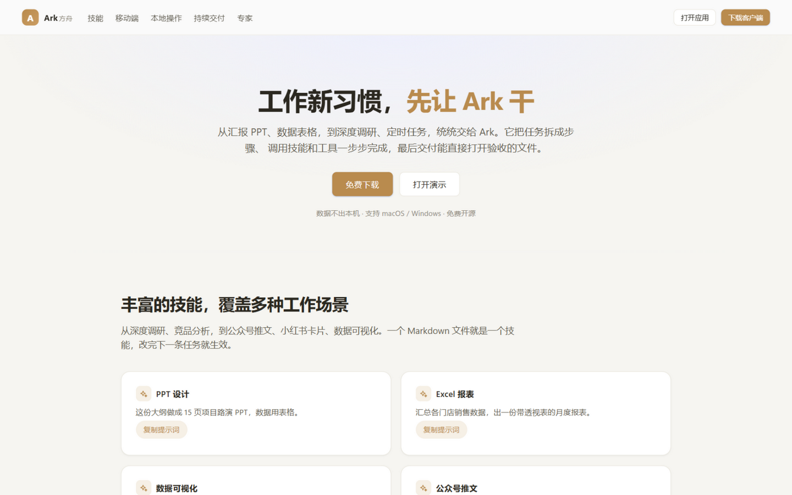
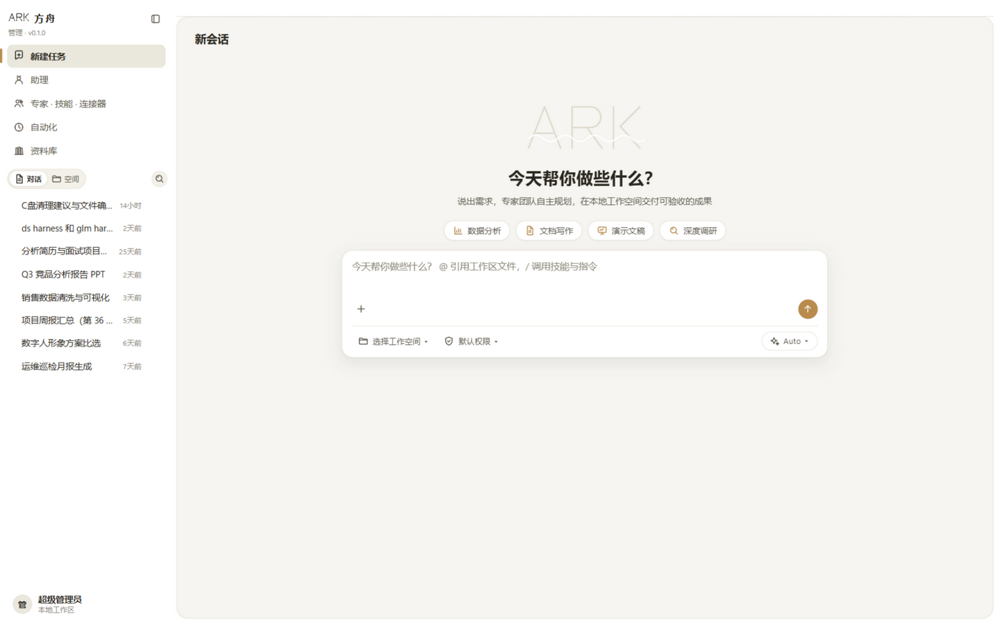

# Ark · 方舟

> 本地优先的 AI Agent 生产力工作台 —— 把一句话需求做成可编辑的成果文件（PPT / Word / Excel / 报告），数据不出本机。

**Ark · 方舟** —— "方舟承载你的工作与数据，安全独立、自主可控、成果归你。"

## 仓库结构
```
apps/
  frontend/        # Web 前端（React+TS+Vite）：官网 + 工作台 ✅ 已实现
  desktop/         # 桌面版（Tauri 2）· 复用 frontend 界面与布局 ✅ 已实现
  backend/         # 后端 API / Agent 编排 · 规划中
docs/              # 内部文档（本地，不提交到仓库）
ARCHITECTURE.md    # 架构文档
CONTRIBUTING.md    # 贡献指南 / 提交规范
```

> 说明：Web 版 `apps/frontend` 与桌面版 `apps/desktop`（Tauri 2，复用同一套界面）均已实现；后端（Agent 编排）规划中。

## 界面预览

> 效果图基于当前 Web 版前端（`apps/frontend`）实拍；桌面版（Tauri）复用同一套界面与布局。

| 官网落地页 | 工作台 |
|---|---|
|  |  |

## 快速开始

### 一键本地启动（推荐，M66）
```bash
npm install          # 仓库根；后端 apps/backend、前端 apps/frontend 亦需各自 npm install
npm run build        # 编后端(含 ESM 修复) + 前端
npm start            # 起后端 :4000 + 前端预览 :4173(代理 /api)，自动开浏览器到 /app
```

### 开发态（tsx + vite dev 热更新）
```bash
cd apps/backend && npm install && npm run dev   # 后端 http://127.0.0.1:4000
cd apps/frontend && npm install && npm run dev  # 前端 http://localhost:5173（/ 官网 · /app 工作台）
```

## 桌面版（Windows）
```bash
cd apps/desktop
npm install
npm run desktop:dev    # 开发模式：拉起桌面窗口（复用 frontend 界面）
npm run desktop:build  # 打包：可执行文件 + 安装包
```

> 桌面版说明：需 Rust（GNU/MSVC 工具链）与 WebView2 运行时（Win10/11 已内置）。界面与 Web 版 1:1 复用，无边框自绘标题栏。详见 `apps/desktop/README.md`。

## 当前进度（摘要）
- ✅ 前端：官网落地页 + 客户端全页面路由打通（mock 数据）
- ✅ 桌面版：Tauri 2 打包本机应用，复用 Web 界面
- 📍 下一步：接真实后端 + LLM
- 🤝 参与开发：见 [CONTRIBUTING.md]

## 文档索引（仓库内）
| 文档 | 说明 |
|---|---|
| `ARCHITECTURE.md` | 架构总览 |
| `PAGES.md` | 页面清单：已生成页面（URL + 用途）+ 待开发项登记 |
| `CONTRIBUTING.md` | 贡献指南、提交规范、运行方式 |

> 产品分析 / 规格书 / 开发日志等内部文档保存在本地 `docs/`，随讨论更新，不随仓库分发。

## 许可
见 [LICENSE]。
